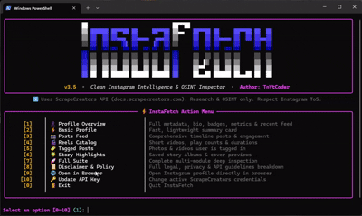

<div align="center">

```text
██                             ██▀▀██                            
▓▓ ██████ ██▀▀██ ██     ██▀▀██ ▓▓▄▄   ██▀▀██ ██     ██▀▀██ ██  ██
▒▒ ▓▓  ▓▓ ▓▓▄▄▄  ▓▓▄▄▄▄  ▄▄▄▓▓ ▒▒     ▓▓  ▓▓ ▓▓▄▄▄▄ ▓▓  ▓▓ ▓▓▄▄▓▓
░░ ▒▒  ▒▒    ▐▒▌ ▒▒     ▐▒▌ ▒▒ ░░     ▒▒  ▒▒ ▒▒     ▒▒     ▒▒  ▒▒
▄▄ ▀▀  ▀▀ ▀▀  ▀▀ ▀▀  ▀▀ ▀▀  ▀▀ ▄▄     ▀▀  ▀▀ ▀▀  ▀▀ ▀▀     ▀▀  ▀▀
░░ ░░  ░░ ░░  ░░ ░░  ░░ ░░  ░░ ░░     ░░  ░░ ░░  ░░ ░░     ░░  ░░
▒▒ ▒▒  ▒▒ ▒▒  ▒▒ ▒▒  ▒▒ ▒▒  ▒▒ ▒▒     ▒▒ ▐▒▌ ▒▒  ▒▒ ▒▒     ▒▒  ▒▒
▓▓ ▓▓  ▓▓ ▓▓  ▓▓ ▓▓  ▓▓ ▓▓  ▓▓ ▓▓     ▓▓▀▀   ▓▓  ▓▓ ▓▓     ▓▓  ▓▓
██ ██  ██ ██████ ██████ ██████ ██     ██▄▄██ ██████ ██▄▄██ ██  ██
```

# ⚡ InstaFetch
### Clean Instagram Intelligence & Profile Inspector

[](https://python.org)
[](LICENSE)
[](https://github.com/TnYtCoder)
[](https://github.com/Textualize/rich)
[](https://github.com/TnYtCoder/InstaFetch/stargazers)

<p align="center">
  A sleek, lightning-fast Instagram intelligence & OSINT CLI inspector.<br/>
  Features a modern Rich-powered terminal UI, interactive menus, live spinners, and comprehensive data tables.
</p>

---

[Key Features](#-key-features) • [Installation](#-installation) • [Quick Start](#-quick-start) • [CLI Usage](#-cli-usage) • [Disclaimer](#-disclaimer) • [Support](#-give-a-star)

---

</div>

## 📸 Preview

<div align="center">
  
</div>

---

## ✨ Key Features

- 👤 **Full Profile Overview**: Bio, external URLs, verified status, follower/following counts, account category, and numeric User ID (PK).
- ⚡ **Basic Profile Summary**: Fast, lightweight summary card for instant account checks.
- 📸 **Posts Timeline Feed**: Color-coded table with shortcodes, likes (♥), comments (💬), views (▶), timestamps, and caption previews.
- 🎬 **Reels Catalog**: Short video performance, play counts, like ratios, video durations, and direct reel URLs.
- 🏷️ **Tagged Media**: Discover public photos and videos the target account has been tagged in.
- 🌟 **Story Highlights**: Saved highlight albums with cover previews, media count, and unique highlight IDs.
- 🚀 **Full Suite Dashboard**: Run complete multi-module deep inspections in a single automated flow.
- 💾 **Instant JSON Export**: Export clean, structured data payloads with automated timestamped filenames.
- 🌐 **Browser Integration**: Direct action to open inspected profiles in your default web browser.
- 🔑 **Interactive Key Switcher**: Change or update your API key anytime without restarting the program.

---

## 🚀 Installation

### 1. Clone the repository
```bash
git clone https://github.com/TnYtCoder/InstaFetch.git
cd InstaFetch
```

### 2. Install dependencies
```bash
pip install -r requirements.txt
```

---

## 🔑 API Key Setup

InstaFetch uses the **ScrapeCreators API** (includes **10,000 free credits** on sign-up).

1. Grab your free API key at [app.scrapecreators.com](https://app.scrapecreators.com).
2. Choose any setup method that fits your workflow:
   - **Method A (Interactive)**: Simply run `python InstaFetch.py` and paste your key when prompted.
   - **Method B (Inline)**: Edit the `API_KEY = "YOUR_KEY"` variable at the top of `InstaFetch.py`.
   - **Method C (Environment)**: Set the environment variable:
     ```bash
     # Linux / macOS
     export SCRAPECREATORS_API_KEY="your_api_key_here"

     # Windows PowerShell
     $env:SCRAPECREATORS_API_KEY="your_api_key_here"
     ```
   - **Method D (CLI Flag)**: Pass `--api-key "your_api_key_here"` with any command.

---

## 💡 Quick Start

### 🖥️ Interactive TUI Mode
Launch the interactive dashboard with animated menus and handle memory:
```bash
python InstaFetch.py
```

```text
╭───────────────────────── ⚡ InstaFetch Action Menu ──────────────────────────╮
│    [1]   │ 👤 Profile Overview    │ Full metadata, bio, badges & recent feed │
│    [2]   │ ⚡ Basic Profile       │ Fast, lightweight summary card           │
│    [3]   │ 📸 Posts Feed          │ Comprehensive timeline posts & engagement│
│    [4]   │ 🎬 Reels Catalog       │ Short videos, play counts & durations    │
│    [5]   │ 🏷️ Tagged Posts        │ Photos & videos user is tagged in        │
│    [6]   │ 🌟 Story Highlights    │ Saved story albums & cover previews      │
│    [7]   │ 🚀 Full Suite          │ Complete multi-module deep inspection    │
│    [8]   │ 📜 Disclaimer & Policy │ Full legal, privacy & API breakdown      │
│    [9]   │ 🌐 Open in Browser     │ Open Instagram profile directly          │
│    [10]  │ 🔑 Update API Key      │ Change active ScrapeCreators credentials │
│    [0]   │ 🚪 Exit                │ Quit InstaFetch                          │
╰──────────────────────────────────────────────────────────────────────────────╯
```

---

## 💻 CLI Usage

InstaFetch also functions as a powerful headless CLI tool for scripting and rapid scans.

### Inspect a profile:
```bash
python InstaFetch.py -u instagram
```

### Full inspection suite (Profile, Posts, Reels, Highlights, Tagged):
```bash
python InstaFetch.py -u virat.kohli --all
```

### Fetch posts and reels, then export to JSON:
```bash
python InstaFetch.py -u zuck --posts --reels -o report.json
```

### Output raw JSON directly to stdout:
```bash
python InstaFetch.py -u instagram --all --json
```

### View comprehensive legal & usage disclaimer:
```bash
python InstaFetch.py --disclaimer
```

### Available CLI Flags:
```text
options:
  -h, --help           Show help message and exit
  --handle, -u HANDLE  Target Instagram username or profile URL
  --api-key API_KEY    ScrapeCreators API key (overrides script & ENV)
  --json               Output raw JSON to stdout instead of UI tables
  --output, -o OUTPUT  File path to save the JSON result
  --trim               Trim response payload for lightweight output
  --cache CACHE        Max cache age for responses (e.g. 1d, 3d, 7d)
  --no-color           Disable rich ANSI color rendering
  --verbose, -v        Print debug URLs and network latency
  --posts              Include user's posts feed
  --reels              Include user's reels
  --tagged             Include tagged posts
  --highlights         Include story highlights
  --basic              Include basic profile metrics
  --all                Fetch complete inspection suite
  --disclaimer         Display comprehensive legal and usage policy
  --open-browser       Open profile in default browser
  --version            Show program version
```

---

## 📜 Disclaimer

> [!IMPORTANT]
> - **API Attribution**: InstaFetch interfaces with the third-party ScrapeCreators API ([docs.scrapecreators.com](https://docs.scrapecreators.com)). InstaFetch is an independent client interface and is not owned or operated by ScrapeCreators.
> - **Meta Non-Affiliation**: InstaFetch and its author (**TnYtCoder**) are not affiliated, associated, authorized, endorsed by, or in any official way connected with Instagram or Meta Platforms, Inc.
> - **Public Data & Privacy**: Only queries publicly accessible account data provided by the API. Does not bypass private protections, decrypt credentials, or store private personal data.
> - **Intended Use**: Strictly intended for academic research, authorized security testing, OSINT, and educational purposes. Users are responsible for complying with Instagram's Terms of Use and local privacy regulations.

---

## ⭐ Give a Star!

If you find **InstaFetch** helpful or inspiring, please consider giving this repository a **Star ⭐**! It helps support ongoing development and lets others discover the tool.

---

## 👨‍💻 Author & Credits

- **Developer**: [TnYtCoder](https://github.com/TnYtCoder)
- **Repository**: [https://github.com/TnYtCoder/InstaFetch](https://github.com/TnYtCoder/InstaFetch)
- **Powered By**: [Rich](https://github.com/Textualize/rich) & [ScrapeCreators](https://scrapecreators.com)
- **License**: [MIT License](LICENSE)
